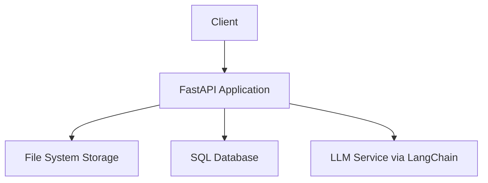

# Rubri-Backend Implementation Plan

## System Architecture

## Implementation Phases

### Phase 1: Core Setup (1-2 days)
- Set up FastAPI application structure
- Define database models (Document, Rubric, RubricHistory)
- Configure LLM integration with LangChain
- Create Pydantic data models for API

### Phase 2: Document Management (1-2 days)
- Implement file upload endpoints for JD and resume
- Create text upload endpoints
- Integrate with Text_Extractor for document processing
- Set up file storage using Directory_Structure

### Phase 3: Rubric Generation (2-3 days)
- Create rubric generation service using LLM
- Implement rubric creation endpoint
- Add rubric update and chat endpoints
- Set up rubric history tracking

### Phase 4: Export & Listing (1-2 days)
- Implement rubric listing with pagination
- Create PDF export functionality
- Add shareable link generation
- Implement rubric history viewing

### Phase 5: Testing & Refinement (1-2 days)
- Write unit and integration tests
- Optimize performance
- Add error handling
- Document API endpoints

## Data Models

### Key Pydantic Models
- DocumentBase/Response: For document metadata
- RubricBase/Response: For rubric data
- TextUpload: For text-based uploads
- RubricChatRequest: For chat-based updates

### Database Models
- Document: Stores uploaded files metadata and extracted text
- Rubric: Stores rubric content and metadata
- RubricHistory: Tracks changes to rubrics

## API Routes

### Upload Routes
- POST /upload/file/jd: Upload JD document
- POST /upload/file/resume: Upload resume document
- POST /upload/text/jd: Upload JD as text
- POST /upload/text/resume: Upload resume as text

### Rubric Routes
- POST /rubric/create: Create rubric from JD/resume
- POST /rubric/chat: Update rubric via chat
- PUT /rubric/edit: Edit rubric directly
- GET /rubric/export/link: Generate shareable link
- GET /rubric/export/pdf: Export as PDF
- GET /rubric/list: List all rubrics

## LLM Integration
- Use LangChain as abstraction layer
- Support multiple providers (OpenAI, Gemini, Claude, Azure)
- Store credentials in environment variables
- Create configure_environment.py for loading credentials
## Future Enhancements (TODOs)

- User Management: Add authentication and user profiles to track who created which rubrics
- Analytics: Implement tracking for rubric usage and effectiveness
- Collaboration: Allow multiple interviewers to work on the same rubric
- Templates: Save and reuse rubric templates for similar positions
- Feedback Loop: Collect feedback on rubric effectiveness and use it to improve future rubrics
- Integration: Connect with ATS (Applicant Tracking Systems) for seamless workflow
- Mobile App: Develop a companion mobile app for on-the-go rubric filling